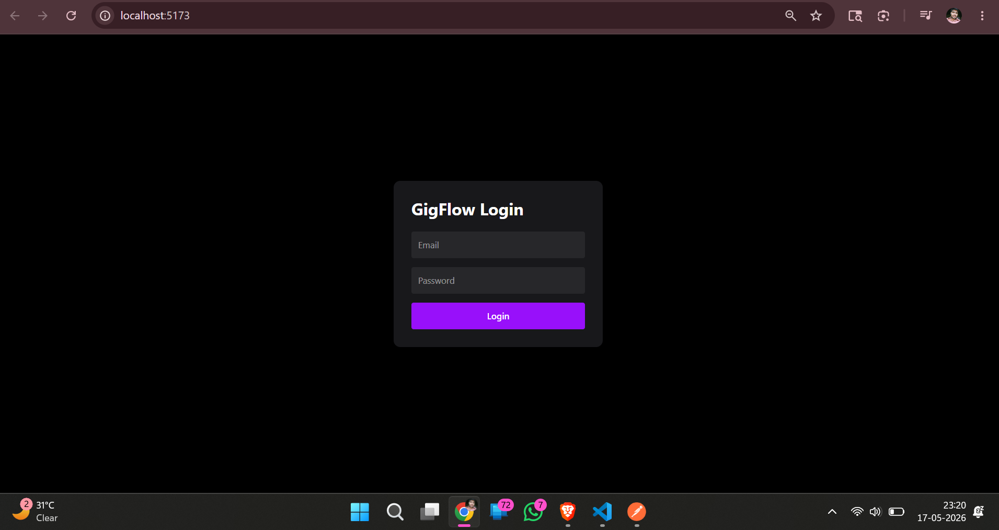
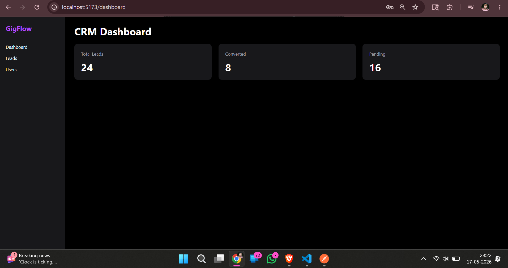
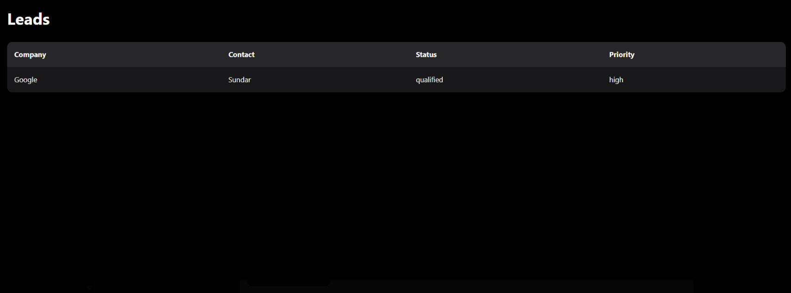

# GigFlow - Smart Leads Dashboard

A full-stack CRM dashboard built using the MERN stack with TypeScript, JWT authentication, role-based access control, and lead management features.

## Tech Stack

### Frontend
- React
- TypeScript
- Tailwind CSS
- Axios
- React Router DOM

### Backend
- Node.js
- Express.js
- TypeScript
- MongoDB Atlas
- Mongoose
- JWT Authentication

---

## Features

### Authentication
- User Registration
- User Login
- JWT Authentication
- Protected Routes
- Role-Based Access Control (Admin / Sales)

### Lead Management
- Create Leads
- Fetch Leads
- Update Leads
- Delete Leads
- Assign Leads
- Update Lead Status

### Advanced Features
- Search Leads
- Filter Leads
- Sort Leads
- Pagination

---

## Project Structure

/client -> React frontend  
/server -> Express backend

---

## Installation

### Backend

```bash
cd server
npm install
npm run dev
```

### Frontend

```bash
cd client
npm install
npm run dev
```

---

## Environment Variables

Create a `.env` file inside `/server`

```env
PORT=5000
JWT_SECRET=your_secret
MONGO_URI=your_mongodb_url
```

---

## API Routes

### Auth Routes

- POST `/api/auth/register`
- POST `/api/auth/login`

### Lead Routes

- GET `/api/leads`
- POST `/api/leads`
- PUT `/api/leads/:leadId`
- DELETE `/api/leads/:leadId`

---

## Screenshots
### Login Page


### Dashboard


### Leads Page


---

## Author

Abhinav